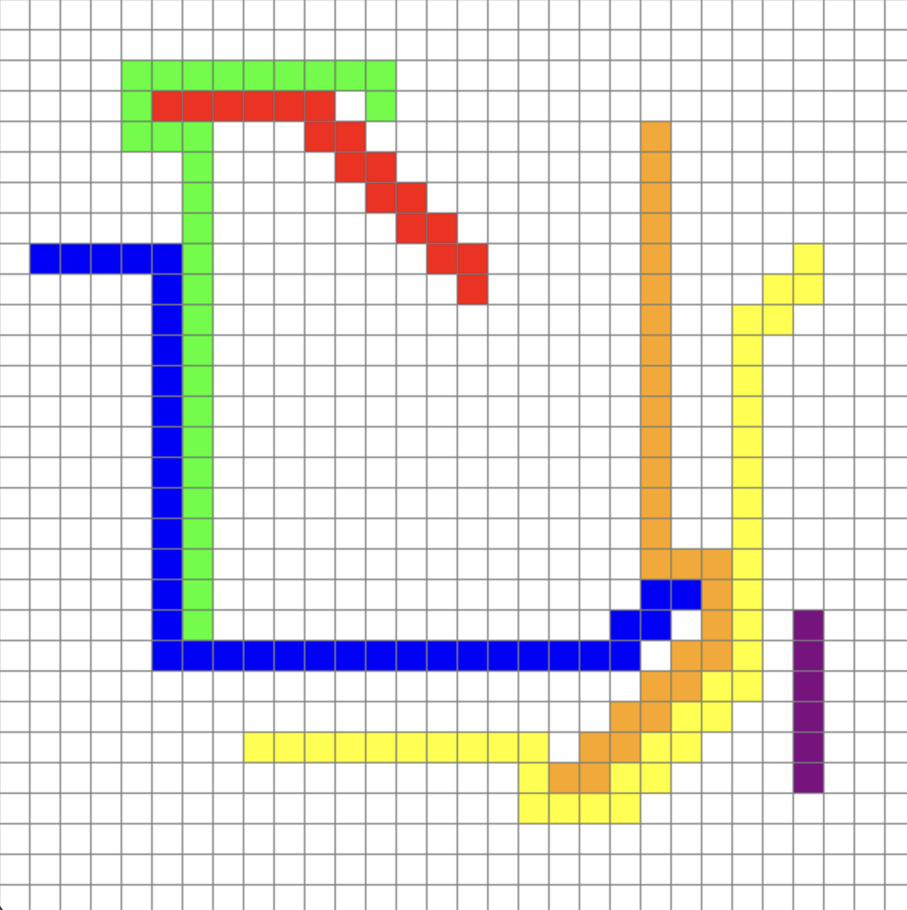

# A* Pathfinding Visualization with Chebyshev Distance



This project is a grid-based pathfinding visualization tool implemented in Python using Pygame. It allows users to interactively place start and end nodes for six different colors and visualize the A* algorithm connecting them using **Chebyshev Distance** as the heuristic.

---

## Features

1. **Chebyshev Distance Heuristic**:
   - Optimized for grids where diagonal movement is allowed and has the same cost as horizontal or vertical movement.
   - Ensures efficient and realistic pathfinding.

2. **Interactive Node Placement**:
   - Users can place start and end nodes for up to six colors by clicking on the grid.

3. **Path Visualization**:
   - Slows down the visualization for better observation of the A* algorithm's progress.

4. **Grid Reset**:
   - Press `C` to clear the grid and start a new game.

5. **Dynamic Pathfinding**:
   - Prevents overlapping of paths by treating previously drawn paths as barriers unless they belong to the same color.

---

## How to Run

### Prerequisites
1. **Python**: Install Python 3.11 or higher.
2. **Pygame**: Install Pygame using pip:
   ```bash
   pip install pygame

---
  
## Instructions for Use

### Placing Nodes
1. Use the **left mouse button** to place nodes on the grid:
   - The first click places the **start node** for a color.
   - The second click places the **end node** for the same color.
   - Repeat this process for up to six colors.

### Visualizing Paths
1. After placing all start and end nodes, press the **SPACEBAR** to visualize the A* algorithm connecting the nodes.
2. The paths for each color will be displayed sequentially.

### Resetting the Grid
- Press the **C key** to clear the grid and start over.

### Keyboard Controls
| Key         | Function                               |
|-------------|---------------------------------------|
| `SPACEBAR`  | Start pathfinding and visualization.  |
| `C`         | Clear the grid and restart.           |
| `QUIT`      | Close the application.                |

---

## Future Improvements

1. **Obstacle Placement**:
   - Add an option for users to place barriers or obstacles dynamically by clicking on the grid.
   - These barriers would block paths and force the algorithm to find alternate routes.

2. **Save and Load Grid Configurations**:
   - Allow users to save their current grid setup (start/end nodes, barriers) to a file.
   - Add functionality to reload saved configurations to continue from where they left off.

3. **Path Metrics Display**:
   - Show metrics for each path, such as total distance, number of steps, and computation time.
   - Display these metrics in real-time or after pathfinding is complete.

4. **Improved Visualization**:
   - Add smoother animations for path visualization.
   - Use gradients or dynamic line drawing to make the path visualization more visually appealing.

5. **Custom Node Types**:
   - Introduce different types of nodes, such as:
     - Weighted nodes with higher traversal costs.
     - Special nodes that offer shortcuts or bonuses.

---

## Acknowledgments

- The articles provided in the assignment pdf
- ChatGPT for questions and errors